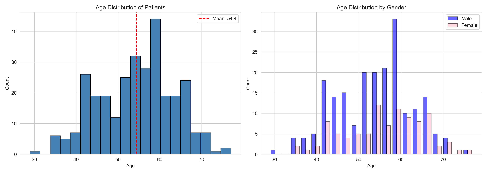
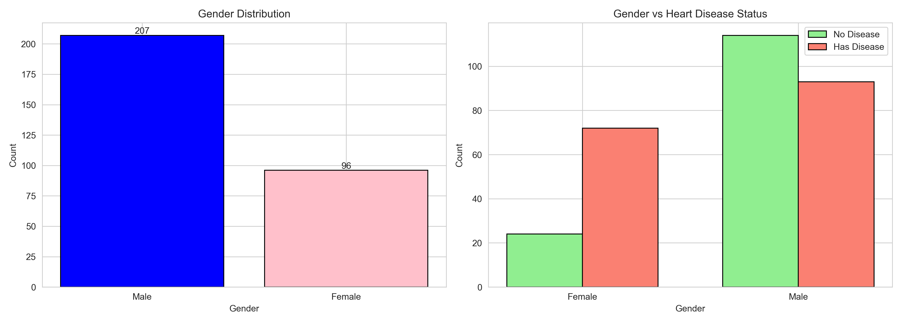
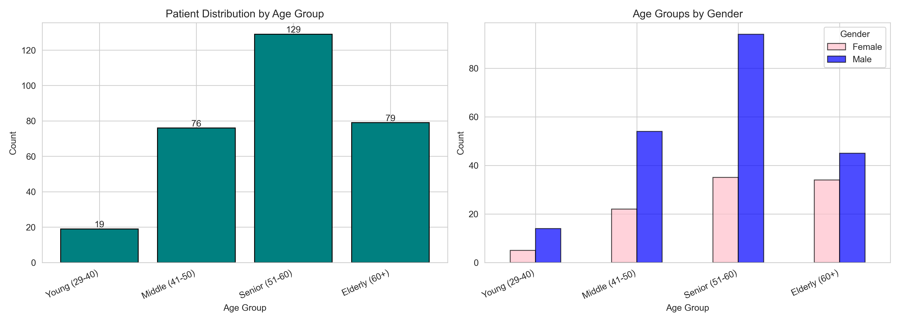

# SCT_DS_01
# 🫀 Heart Disease Dataset - Data Visualization

## 📋 Task Description

Create **bar charts** and **histograms** to visualize the distribution of categorical (gender) and continuous (age) variables in a dataset.

## 🔍 How was it done?

The **Heart Disease dataset** from the UCI Machine Learning Repository containing 303 patient records was taken. The data was loaded using Python and pandas, then created three main visualizations:

1. **Histograms** showing age distribution of all patients and separated by gender
2. **Bar charts** displaying gender distribution and its relationship with heart disease status  
3. **Age group analysis** categorizing patients into Young (29-40), Middle (41-50), Senior (51-60), and Elderly (60+) groups

matplotlib and seaborn libraries were used to create the visualizations and saved them as PNG files.

## 📊 Dataset Source

**UCI Machine Learning Repository - Heart Disease Dataset**

- **URL:** https://archive.ics.uci.edu/dataset/45/heart+disease
- **Records:** 303 patients
- **Attributes:** 13 features including age, sex, chest pain type, blood pressure, cholesterol levels, and heart disease diagnosis

## 💡 Key Findings

- **68.3% male, 31.7% female** patients in the dataset
- **Age range:** 29 to 77 years with an average age of 54.4 years
- **54.5% of patients** have heart disease
- **Middle-aged patients (50-60 years)** form the largest group
- **Males** show higher heart disease incidence across all age groups
- Most patients fall in the **middle age and senior categories**, indicating heart disease primarily affects older populations

## 🎨 Visualizations

### Age Distribution

### Gender Distribution

### Age Groups Analysis

## 🔧 Tech Stack

- **Python 3.8+**
- **Pandas** - Data manipulation
- **Matplotlib** - Data visualization
- **Seaborn** - Enhanced visualizations
- **NumPy** - Numerical operations
- **Jupyter Notebook** - Interactive analysis

## 📈 Results Summary

| Metric | Value | Description |
|--------|-------|-------------|
| **Total Patients** | 303 | Complete dataset records |
| **Male Patients** | 207 (68.3%) | Majority male population |
| **Female Patients** | 96 (31.7%) | Female representation |
| **Age Range** | 29-77 years | Wide age distribution |
| **Average Age** | 54.4 years | Mean patient age |
| **Heart Disease** | 165 (54.5%) | Patients with diagnosis |

